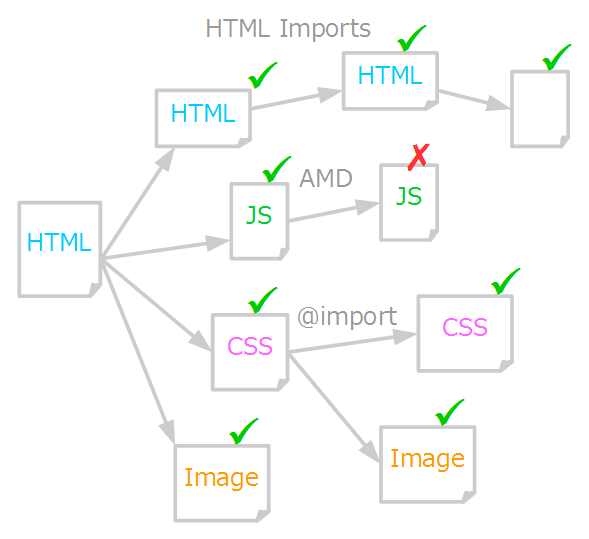
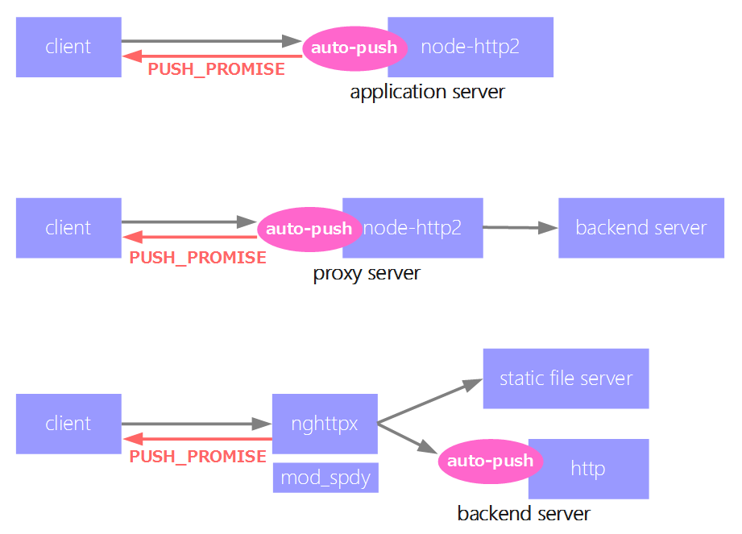

# auto-push
[](https://travis-ci.org/jinjor/auto-push)
[](https://coveralls.io/r/jinjor/auto-push?branch=master)

A HTTP/2 middleware for Node.js that automatically parse HTML and push its sub-resouces to the client.

It wraps a middleware and create new one, where a middleware is a function like

```javascript
function(req, res, next) {
  // some operation here
}
```
.

## Ability

This module recursively find resources and push for each of them.



## Usage

This module works for several use cases.



## Example

### As an application server

```javascript
var fs = require('fs');
var autoPush = require('auto-push');
var http2 = require('http2');
var ecstatic = require('ecstatic');

var options = {
  key: fs.readFileSync(__dirname + '/ssl/key.pem'),
  cert: fs.readFileSync(__dirname + '/ssl/cert.pem')
};

http2.createServer(options, autoPush(ecstatic(__dirname + '/public'))).listen(8443);
```

### As a proxy server

```javascript
var autoPush = require('auto-push');
var http = require('http');
var ecstatic = require('ecstatic');
var request = require('request');
var fs = require('fs');
var http2 = require('http2');

// server
http.createServer(ecstatic(__dirname + '/public')).listen(8080);

// proxy
var options = {
  key: fs.readFileSync(__dirname + '/ssl/key.pem'),
  cert: fs.readFileSync(__dirname + '/ssl/cert.pem')
};
http2.createServer(options, autoPush(function(req, res) {
  request({
    method: req.method,
    url: 'http://localhost:8080' + req.url,
    headers: req.headers
  }).pipe(res);
})).listen(8443);
```

### As an application server with reverse proxy

With this option, the server sends additional response header and let the proxy server push resources.

Limitation: only the shallowest sub-resources are the target.

```javascript
var autoPush = require('auto-push');
var http = require('http');

// server
http.createServer(autoPush(function(req, res) {
  request({
    method: req.method,
    url: 'http://localhost:8080' + req.url,
    headers: req.headers
  }).pipe(res);
}, {
  mode: 'nghttpx'
})).listen(8080);
```

## API

The second argument is optional.

```javascript
var options = {
  // Modes
  mode: 'nghttpx'// use nghttpx as a reverse proxy
  mode: 'mod_spdy'// use htdpd (with mod_spdy) as a reverse proxy

};
```
